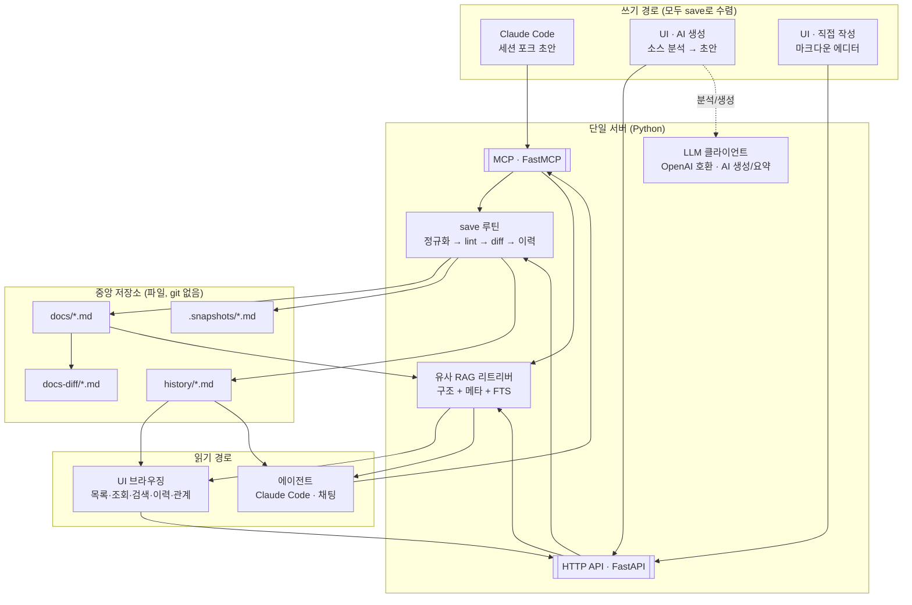
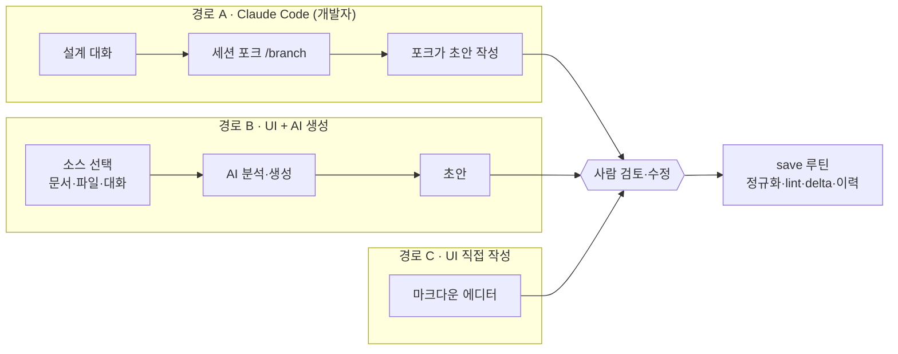
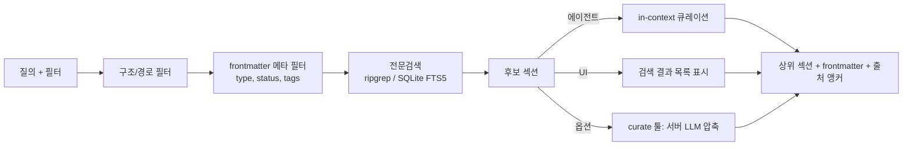

## title: 팀 내부 지식 허브 (MVP) — Why 중심 · 유사 RAG · MCP 중앙관리 · 경량 UI
type: proposal
scope: team-internal
status: draft
version: 1.2
updated: 2026-07-08
supersedes: 에이전트 지식 스토리지 초기 기획안 v0.7 (헤비 RAG 버전)
note: v0.7의 "자체 delta 이력"은 채택, "헤비 벡터 RAG"는 유사 RAG로 대체, 읽기/쓰기 경량 UI 추가

# 기획안 1 — 팀 내부 지식 허브 (MVP)

> **한 줄 요약:** 우리 팀의 ADR·설계 의도·컨벤션을 **구조화된 마크다운 파일**로 중앙관리하고,
**벡터 DB 없이** 구조·메타·전문검색으로 후보를 뽑아 **에이전트가 큐레이션**하는(유사 RAG)
**단일 서버(MCP + HTTP)** 를 만든다. 이력은 **git 없이 자체 delta**로 남기고, **읽기/쓰기 경량 UI**를
제공하되 쓰기는 **사람 직접 작성 + UI 안의 AI 생성** 두 방식을 지원한다. 무거운 인프라는 정말 필요해질
때(→ 기획안 2) 붙인다.
> 

---

## 1. 배경과 방향 전환

이전 기획안(v0.7)은 PostgreSQL + pgvector + Qwen 임베딩 + vLLM 리랭커라는 **풀 벡터 RAG 스택**을 세웠다.
그러나 이 프로젝트의 영감이 된 하네스 사례(바이브마피아 최수민)의 실제 결론은 정반대였다:

> **잘 구조화된 파일 시스템 + 필터링 서브에이전트(유사 RAG)만으로 대부분의 업무가 된다.**
> 

또한 Claude Projects가 이미 자동 RAG를 상용 기능으로 제공하므로, **범용 벡터 RAG로 정면 승부하면
"설정 없이 되는 Projects"에 밀린다.** 따라서 MVP의 전략:

- **범용 벡터 RAG를 만들지 않는다.** 구조화 파일 + 유사 RAG로 시작한다.
- **차별점은 "Why"에 몰빵한다** — 결정의 배경/대안/트레이드오프/폐기 선택지, 그리고 그 결정의 변경 이력.
- **이력은 git 없이 자체 delta**로 남긴다(v0.7 계승).
- **읽기/쓰기 경량 UI**를 제공한다 — 사람이 눈으로 브라우징하고, UI 안에서 AI로 문서를 생성·분석한다.
- **우리 팀 안에서 중앙관리**부터 검증하고, 규모·권한·다중 소비자 벽에 부딪힐 때 기획안 2로 승격한다.

## 2. 목표 / 비목표

### 목표

1. 팀의 비정형 지식을 **에이전트가 읽기 쉬운 정규화 마크다운**으로 중앙 집약
2. **Why를 1급 데이터로** 저장 (ADR + 설계 의도 문서)
3. 결정의 **변경 이력을 질의 가능한 콘텐츠**로 유지 (자체 delta)
4. **에이전트(MCP) + 사람(UI)** 두 소비 경로 제공
5. **쓰기 지원**: 사람 직접 작성 + UI 안의 AI 생성 + 에이전트(세션 포크)
6. **벡터 인프라 없이** 동작 (구조 + 메타 + 전문검색 + 큐레이션)

### 비목표 (MVP에서 안 함)

- 범용 위키/노션 대체 (원본 도구는 그대로, 여기로 "정규화·색인"만)
- **벡터 임베딩·리랭커·GPU 인프라** (→ 기획안 2)
- **git 의존** (버전·이력은 자체 스냅샷/delta로 자립)
- **문서 단위 세밀 ACL·역할 분리·권한 관리 UI** (팀 내부라 접근 = 팀 전원. → 기획안 2)
- 멀티테넌트·토큰 인증 (→ 기획안 2)
- 실시간 협업 편집, 자동 폴링·웹훅 동기화

## 3. 설계 철학

| 원칙 | 내용 |
| --- | --- |
| What이 아니라 Why | 무엇이 아니라 왜 이렇게 결정했는지를 저장 |
| 유사 RAG 우선 | 벡터 대신 구조·메타·전문검색 후보 → 에이전트/사람이 큐레이션 |
| 파일 = 원천 | 본문·스냅샷·이력은 파일(마크다운). DB는 최소한(또는 없음) |
| 이력도 읽힌다 | git 없이 자체 delta로, 변경 이력을 1급 콘텐츠로 저장 |
| 쓰기는 단일 관문 | 어느 경로로 쓰든 반드시 save 루틴을 거친다 (직접 파일 수정 금지) |
| AI 초안 + 사람 검토 | Why를 채우는 부담을 AI가 덜고, 최종 책임은 사람이 |
| 정규화 무결성이 신뢰의 근간 | lint·정규화 테스트를 통과한 문서만 저장·색인 |
| 단일 서버 | MCP(에이전트) + HTTP(UI)가 같은 코어를 공유 |

## 4. 아키텍처 (경량)



핵심 두 가지. (1) **"지능은 에이전트/사람에게, 서버는 좋은 후보만"** — 서버는 벡터 없이 구조·메타·전문검색으로
후보를 반환하고 큐레이션은 소비자가 한다. (2) **모든 쓰기는 save 루틴 단일 관문**을 거친다 — Claude Code든,
UI의 AI 생성이든, UI 직접 작성이든 결국 같은 정규화·delta·이력 처리를 받는다.

## 5. 데이터 모델

### 5.1 문서 frontmatter

```markdown
---
id: adr-0007
type: adr              # adr | design-intent | guide | spec | note | reference
title: 인증 방식으로 JWT 대신 세션 채택
status: accepted       # proposed | accepted | deprecated | superseded
tags: [auth, security, backend]
related: [adr-0003, spec-auth-flow]
supersedes: adr-0002
source: notion:page_id # 인제스천 출처 (있을 경우)
author: alice
created: 2026-06-01
updated: 2026-07-01
---
```

### 5.2 두 계층 문서 (하네스 사례 반영)

| 계층 | 용도 | 저장 위치 | 특징 |
| --- | --- | --- | --- |
| **ADR** | 공용 설계 의사결정 기록 | `docs/adr/` | 지속 관리, 온보딩용. "왜"의 핵심 |
| **설계 의도 문서** | 특정 작업 한정 상세 설계 | `docs/design-intent/` | ADR보다 자세, 사람 검토 필수 |

### 5.3 저장소 구조

```
knowledge/
  docs/
    adr/            adr-0007.md
    design-intent/  di-2026-07-billing.md
    guide/          ...
  .snapshots/       adr-0007.md              # 직전 스냅샷 (diff 기준점, 내부용)
  docs-diff/        adr-0007.2026-07-01.md   # 의도된 변경 (스펙 선구동)
  history/          adr-0007.history.md      # 자동 delta 이력 (append-only)
  index.json        # 경량 인덱스 (id ↔ 경로 ↔ 메타)
```

## 6. 쓰기 경로와 Why 캡처 (세 경로 → 단일 save)

이 프로젝트 최대 리스크는 기술이 아니라 **"사람이 Why를 실제로 써주느냐"** 다. 그래서 쓰기 경로를 셋으로
열되, 두 경로(포크·UI-AI)는 **AI가 초안 → 사람이 검토·확정** 패턴으로 부담을 낮춘다. 세 경로 모두
**동일한 save 루틴**(7절)으로 수렴한다.



### 6.1 경로 A — 세션 포크 (Claude Code에서, "세션 포크 초안 + save"의 정확한 정의)

"세션 포크"는 Claude Code의 실제 기능이다. 현재 사양은 다음과 같다:

- 세션 안에서 `/branch`, 또는 CLI에서 `claude --resume <id> --fork-session` / `claude --continue --fork-session`로
**현재 대화의 전체 맥락을 복사한 새 세션**을 만든다. 원본 세션은 그대로 남는다(새 세션 ID 부여).
- 중요한 성질: **포크는 "대화 이력"만 분기하고 "파일시스템"은 분기하지 않는다.** 포크 세션이 파일을 쓰면
그 파일은 실제로 남고 원본 작업 디렉토리에서도 보인다. (`/fork`는 이동 없이 서브에이전트에 위임하는 변형)

우리한테는 이 성질이 정확히 유리하다 — **문서 파일은 남기고, 대화 세션만 버리면 되기 때문**이다.
그래서 "세션 포크 초안 + save"의 전체 흐름은:

1. 설계 대화를 충분히 나눈 메인 세션에서 **포크**(`/branch`)한다.
2. 포크 세션에게 "이 맥락으로 ADR/설계의도 초안을 써라"고 지시 → 포크가 **초안 파일을 생성**(또는
`save_document` 툴 호출)한다.
3. **사람이 초안을 검토·수정**한다.
4. **save 루틴**으로 저장한다 (정규화 → lint → 스냅샷 diff → 이력 append → 스냅샷 갱신 → 재색인).
5. **포크 세션은 폐기**한다 — 문서(파일)는 남고 대화 분기만 버려져 **메인 세션의 컨텍스트가 보존**된다.
(throwaway가 필요하면 print 모드의 `-no-session-persistence`도 가능)

> 요컨대 "세션 포크"는 **초안을 만드는 여러 방법 중 하나**(개발자가 Claude Code에서 작업할 때)이고,
"save"는 **모든 쓰기가 도착하는 공통 백본**이다. 포크의 이점은 *파일 격리가 아니라 대화 컨텍스트 보존*이다.
> 

### 6.2 경로 B — UI 안에서 AI 생성

UI에는 포크할 CLI 세션이 없다. 대신 **서버가 LLM(OpenAI 호환)을 호출**해 초안을 만든다. 흐름:

1. 사용자가 UI에서 **소스**를 고른다 — 허브 내 기존 문서 / 업로드 파일 / 붙여넣은 텍스트·대화.
2. **타깃 타입**을 고른다 (ADR / design-intent / guide).
3. 서버가 소스 + **관련 기존 ADR(리트리버로 자동 수집, 일관성용)** + 타입별 템플릿으로 LLM을 호출해
**필수 섹션(배경/결정/근거/대안/결과)을 채운 초안**을 생성한다.
4. UI 에디터에서 **사람이 검토·편집**한다.
5. **save 루틴**으로 저장 (경로 A와 동일한 게이트).

> 상세는 `구현스펙-generate-M8.md`(초기 v0) 참조 — `POST /generate`는 초안을 **반환만** 하고,
저장은 사람 검토 + lint + save를 거친다. 프롬프트 문구는 골든 셋으로 반복 튜닝하는 대상이다.
> 

### 6.3 경로 C — UI 직접 작성

frontmatter 폼 + 마크다운 에디터로 **사람이 직접** 작성·수정 → save 루틴. AI 없이도 되는 가장 단순한 경로.

### 6.4 Why가 비지 않게 하는 장치

- 템플릿 + lint로 ADR 필수 섹션(**배경/결정/근거/대안/결과**)을 강제. 대안·폐기 선택지가 비면 **save 게이트가
저장을 차단**한다 (11절).
- 포크·UI-AI 초안 모두 이 템플릿으로 생성 → 처음부터 구조가 맞는 초안이 나온다.

## 7. 이력 · 변경 관리 (자체 delta, git 없음)

v0.7의 **자체 delta 방식**을 채택한다. git 없이, 저장 시점에 스냅샷과 diff를 떠서 변경 이력을 자동 생성하고,
그 이력 자체를 에이전트/사람이 읽는 1급 콘텐츠로 남긴다.

### 7.1 저장 구조

```
docs/       adr-0007.md            # 현재 문서
.snapshots/ adr-0007.md            # 직전 스냅샷 (diff 기준점 · 내부용)
history/    adr-0007.history.md     # append-only 이력
```

### 7.2 저장(갱신) 시 동작 — save 루틴 (모든 쓰기 경로 공통)


이력 항목 예시:

```yaml
- ts: 2026-07-01T10:20
  actor: alice
  type: revision          # created | revision | deprecation | supersede | ingest
  anchor: "#결정"
  summary: "결정 섹션 변경: JWT → 서버 세션"   # 규칙 기반 (LLM 추정 시 source: auto-llm)
  delta: |
    - JWT, 만료 15분
    + 서버 세션 + Redis
```

### 7.3 docs-diff (스펙 선구동) — "의도된 변경"

7.2의 `delta`가 **실제로 무엇이 바뀌었나(사후·자동)** 라면, docs-diff는 **무엇을 바꾸려 하는가(사전·의도)** 다.
두 diff를 대조하면 **의도 대비 실제의 드리프트**를 잡을 수 있다.

### 7.4 자동 summary 전략

- **(기본) 규칙 기반** 요약. **(확장) LLM 요약**은 `source: auto-llm`으로 사실과 구분. `delta`(무엇)는 항상 정확.

> **정합성(정직하게):** 파일(문서·스냅샷·이력)과 인덱스(FTS)에 걸친 갱신은 **원자적 트랜잭션이 아니다.**
save를 한 단계로 감싸 실패 시 롤백/재시도하고, 서버 기동/주기 실행 시 **reconcile**로 수렴시킨다.
스냅샷이 없으면 "전체를 초기 created"로 안전 처리 + 해시로 손상 감지.
> 

## 8. 검색 전략 — 유사 RAG (벡터 없음)



1. **구조/메타 필터**(선행) → 2. **전문검색**(ripgrep 또는 SQLite FTS5, BM25) → 3. **큐레이션**(에이전트는
컨텍스트 안에서, UI는 결과 목록으로, 필요 시 `curate` 옵션) → 4. **출처(`id` + 섹션 앵커)** 반환. 앵커 단위
인용은 Projects RAG가 약한 부분이라 강점으로 내세운다.

> **확장 여지:** 코퍼스가 커져 후보 품질이 떨어지면 **툴·API 인터페이스는 그대로 두고** 리트리버 내부만
벡터/하이브리드로 교체(→ 기획안 2). MVP에서는 미리 만들지 않는다.
> 

## 9. 브라우징 UI (읽기/쓰기 + AI 생성)

**경량**을 유지하되 읽기와 쓰기를 모두 지원한다. UI는 파일에 직접 접근하지 않고 **반드시 HTTP API를 경유**하며,
쓰기는 API를 통해 **save 루틴**으로 들어간다(에이전트와 동일한 경로·게이트).

### 9.1 읽기 기능

- **문서 목록** — `type`/`status`/`tags` 필터
- **문서 조회** — 마크다운 + mermaid 렌더링
- **검색** — 8절 유사 RAG 검색을 UI에서 (결과에 출처 앵커 표시)
- **이력 보기** — `history`의 delta/summary/actor 타임라인
- **관계/계보 보기** — `related`/`supersedes` 그래프 (결정이 어떻게 대체됐는지)

### 9.2 쓰기 기능

- **직접 작성/수정** (경로 C) — frontmatter 폼 + 마크다운 에디터
- **AI 생성** (경로 B) — 소스 선택 → 타입 선택 → AI가 템플릿 채운 초안 생성 → 검토·편집 → 저장
- **lint 피드백** — save 게이트에서 실패하면 UI에 **사유를 표시하고 저장을 차단**(예: "대안 섹션 비어 있음")

### 9.3 아키텍처 함의

- 서버가 **이중 인터페이스**: MCP(에이전트) + **HTTP API(UI)**. 둘 다 같은 코어(save·리트리버·LLM)를 공유.
- **LLM 클라이언트가 "옵션"에서 "AI 생성 쓰면 필요"로 격상.** 단 호스팅 API로 시작(GPU 불필요).
- **권한(MVP):** UI 접근 = 팀. 다만 UI가 쓰기를 하므로 최소한의 식별(이름 선택 또는 간단 로그인)으로
`actor`만 받아 기록. 세밀 권한·감사 열람 화면은 기획안 2.

### 9.4 구현 선택 — 경량 커스텀 프론트 (FastAPI + HTMX / 작은 SPA)

FastAPI가 이미 UI용 HTTP 계층이므로, 별도 프레임워크 없이 **FastAPI가 프론트까지 서빙**한다. 두 스타일 중
선택(혼용 가능):

- **HTMX (서버 렌더링):** 목록·조회·검색·이력·관계 같은 **읽기/브라우징에 최적**. JS 최소, 페이지 부분 갱신.
FastAPI가 HTML 조각을 반환하고 HTMX가 스왑.
- **작은 SPA (React/Svelte 등):** AI 초안을 다듬는 **에디터 경험이 중요할 때** 유리(라이브 프리뷰, 편집,
의도 대비 실제 diff 뷰). FastAPI JSON 엔드포인트를 소비.
- **권장 조합:** 읽기·브라우징은 **HTMX**로 가볍게, 편집/AI 생성 뷰만 **마크다운 에디터 컴포넌트**
(CodeMirror 등)를 얹는다. 필요가 커지면 그 뷰를 작은 SPA로 승격.
- **렌더링:** 마크다운 + mermaid는 서버(렌더 후 HTML) 또는 클라이언트 라이브러리 중 택1.

> Streamlit/Gradio는 프로토타입용으로만 고려. 마크다운 편집·브라우징·렌더링 통제가 제한적이라 기본에서 제외.
**읽기 UI(M6)만으로도 가치가 크다** → 쓰기(M7)·AI 생성(M8)은 순차 도입 가능(로드맵 참조).
> 

## 10. 권한 (MVP는 단순하게)

git이 없으므로 저장소 권한에 기댈 수 없다. **서버(MCP+HTTP) 접근 경계 = 팀 접근 경계**로 시작한다.

- 문서 저장소는 서버(또는 팀 공유 볼륨)에 두고, 서버를 팀 신뢰 경계 안에서만 접근 가능하게 배포.
- **모든 쓰기(에이전트·UI 공통)는 save 루틴을 경유** → 서버가 정규화·delta·이력·스냅샷을 일관 처리하고
`actor` 기록. **파일 직접 수정 우회 경로를 만들지 않는다.**
- 문서 단위 ACL, 역할 분리, 토큰, 권한 관리 UI는 **비목표**(→ 기획안 2).

## 11. 인터페이스 (MCP 도구 + HTTP API)

에이전트는 MCP 도구를, UI는 대응하는 HTTP 엔드포인트를 쓴다. 둘 다 같은 코어를 호출한다.

| 기능 | MCP 도구 | HTTP (UI) | 우선순위 |
| --- | --- | --- | --- |
| 검색 | `search_knowledge(query, filters)` | `GET /search` | P0 |
| 조회 | `get_document(id)` | `GET /docs/{id}` | P0 |
| 목록 | `list_documents(...)` | `GET /docs` | P0 |
| 이력 | `get_history(id, ...)` | `GET /docs/{id}/history` | P0 |
| 의도된 변경 | `get_docs_diff(id, ...)` | `GET /docs/{id}/diff` | P0 |
| 저장 | `save_document(doc)` | `PUT /docs/{id}` | P1 |
| AI 생성 | — | `POST /generate` (소스→초안) | P1 |
| 계보 | `get_related(id)` | `GET /docs/{id}/related` | P1 |
| 후보 압축 | `curate(query, ids)` | (내부) | P1 |
| 인제스천 | `ingest_source(source_ref)` | `POST /ingest` | P1 |

## 12. 정규화 · Linting (원본의 강점 유지)

save 루틴의 첫 관문. 통과 못 한 문서는 저장·색인 파이프라인에 안 태운다.

**(1) 스키마 검증** — frontmatter 필수 필드·타입·enum; `id` 유일성; `related`/`supersedes` dangling 차단;
**ADR 필수 섹션(배경/결정/근거/대안/결과) 존재**.

**(2) 정규화 테스트** — 멱등성 `normalize(normalize(x))==normalize(x)`; 앵커 무결성; 섹션 추출 가능성;
포맷 유효성(markdown/YAML, 깨진 링크 없음).

**적용 지점**: save 게이트 + CI 정기 실행. **UI는 실패 사유를 사용자에게 표시**(9.2).

## 13. 기술 스택 (경량)

| 영역 | 선택 | 비고 |
| --- | --- | --- |
| 언어 | Python |  |
| 에이전트 인터페이스 | FastMCP |  |
| **UI 인터페이스** | **FastAPI** | UI용 HTTP API |
| **UI 프론트** | **커스텀 경량 (FastAPI + HTMX / 작은 SPA)** | 읽기=HTMX, 편집=마크다운 에디터 컴포넌트 |
| 마크다운 에디터 | CodeMirror 등 | AI 초안 편집·라이브 프리뷰 |
| 저장 | 파일 저장소 (서버/공유 볼륨) | 본문·스냅샷·docs-diff·이력 |
| 이력/버전 | **자체 스냅샷 + delta** | git 의존 없음 |
| 검색 | ripgrep 또는 SQLite FTS5(BM25) | 벡터·DB 서버 불필요 |
| 인덱스 | `index.json` + FTS | 경량 |
| 정규화/lint | Python(마크다운/YAML 파서) | save 게이트 |
| **LLM** | **OpenAI 호환 클라이언트** | AI 생성·요약·curate. 호스팅 API로 시작 |
| 렌더링 | 마크다운 + mermaid | UI 조회용 |

> **GPU·vLLM·pgvector·git 전부 없음.** LLM은 호스팅 API로 시작 → self-host는 볼륨 정당화 시.
> 

## 14. 로드맵 (MVP)

| 단계 | 범위 | 산출물 |
| --- | --- | --- |
| **M1** | 파일 저장소 + **자체 스냅샷/delta 엔진** + frontmatter 스키마 + lint/정규화 테스트 + 경량 인덱스 | 정규화된 문서·이력 저장소 |
| **M2** | 서버 코어 + 읽기 도구 4종 + FTS + **MCP·HTTP 이중 인터페이스** | 에이전트·API로 검색·조회 |
| **M3** | Why 캡처(세션 포크 + 템플릿) + docs-diff + `save_document` | "왜"가 채워지기 시작 |
| **M4** | `ingest_source` + `get_related` + `curate`(옵션) | 채팅/명령으로 데이터 세팅 |
| **M5** | 평가 셋(골든 질의) + 검색 품질 점검 | recall/precision 추적 |
| **M6** | **읽기 UI** (목록·조회·검색·이력·관계) | 사람이 눈으로 브라우징 |
| **M7** | **쓰기 UI** (직접 작성 + save 경유 + lint 피드백) | 사람 직접 작성/수정 |
| **M8** | **AI 생성 UI** (`POST /generate`: 소스 분석 → 초안 → 검토 → save) — 스펙: `구현스펙-generate-M8.md`(v0) | UI에서 AI로 ADR/MD 생성 |

> 평가 셋(M5)은 늦어도 M2 직후 **작게라도**. UI는 코어(M2·M3) 위에서 M6→M7→M8 순으로 쌓는다.
**읽기 UI(M6)만 먼저 내도** 팀 체감 가치가 크다.
> 

## 15. 리스크 및 대응

| 리스크 | 대응 |
| --- | --- |
| **Why 미작성 (최대 리스크)** | 세션 포크/UI-AI 초안 + 템플릿/lint 강제. 대안·폐기 비면 저장 차단 |
| **AI 생성 초안 부정확** | 초안일 뿐 **사람 검토가 저장 게이트**. lint로 구조 강제, 관련 ADR을 컨텍스트로 제공해 일관성↑ |
| **UI 쓰기 우회** | UI도 반드시 HTTP→save 경유. 파일 직접 수정 경로 없음 |
| **미러 스테일니스** | 사용자 트리거만 → `updated`·`source` 시각 노출, stale 표시 |
| **정합성(파일↔인덱스)** | save를 한 단계로 감싸 실패 시 롤백/재시도 + reconcile. 원자성 아님 전제 |
| **스냅샷 유실** | 없으면 초기 created 처리 + 해시 무결성 체크 |
| **인제스천 중복** | `source` 키 멱등 처리 + 문서 단위 락 |
| **FTS 한계(대규모)** | 규모 벽에 부딪히면 기획안 2로 벡터 에스컬레이션 |

## 16. 기획안 2(범용)와의 관계

MVP는 범용 버전의 **씨앗**이다.

- **유지되는 것:** Why 중심 콘텐츠 모델, 마크다운 + frontmatter, **자체 delta 이력 + 스냅샷**, 유사 RAG 철학,
MCP/HTTP 인터페이스, **읽기/쓰기 UI + AI 생성**, 정규화/lint, docs-diff, 세 쓰기 경로.
- **기획안 2에서 추가되는 것:** 멀티테넌트 + 토큰 인증, 쿼리 레벨 ACL + 감사, 커넥터(노션/시트),
배포 패키징, **권한·감사 관리 UI(기획안 1 UI 위에 확장)**, (필요 시에 한해) 벡터/하이브리드 백엔드.

**승격 트리거(이 중 하나라도 발생 시 기획안 2 착수):**

1. 우리 팀 밖(다른 팀/조직)에서 쓰고 싶다는 요구
2. 문서/프로젝트 단위 세밀 권한이 실제로 필요
3. 코퍼스가 커져 FTS 후보 품질이 눈에 띄게 저하
4. 여러 에이전트/제품이 붙는 재사용 서비스로 노출 필요