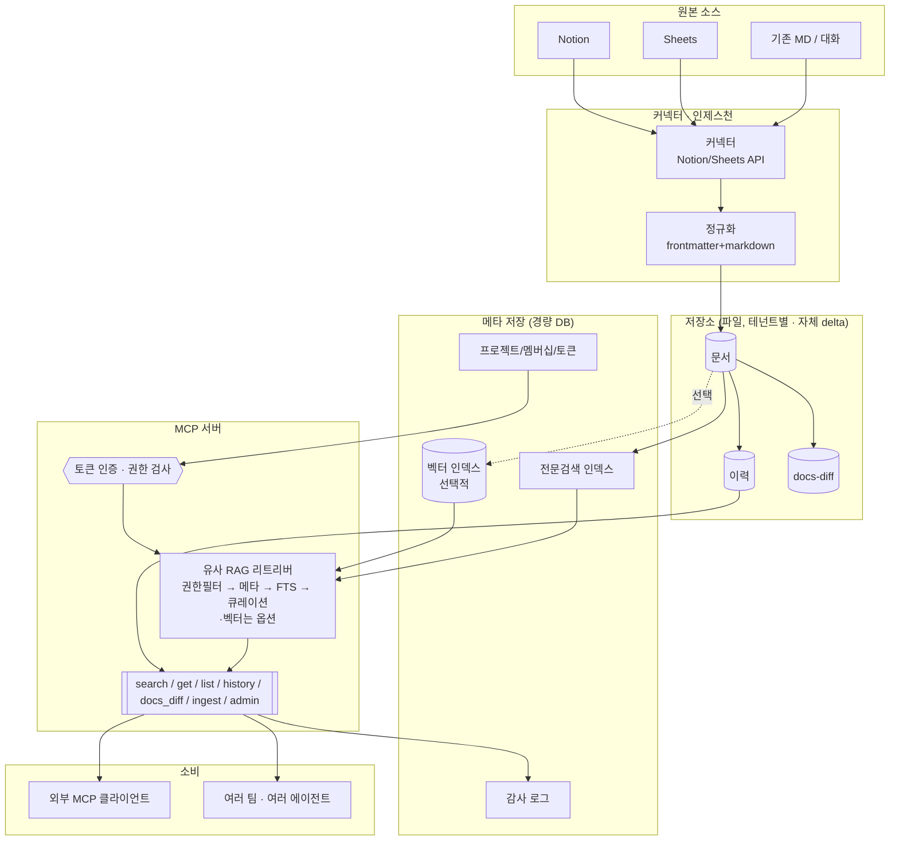
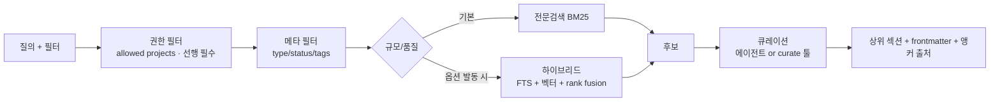

## title: 범용 지식 허브 (확장) — 멀티테넌트 · 권한 · 커넥터
type: proposal
scope: general-purpose
status: draft
version: 1.0
updated: 2026-07-08
builds-on: 기획안 1 — 팀 내부 지식 허브 (MVP)

# 기획안 2 — 범용 지식 허브 (확장)

> **한 줄 요약:** 기획안 1(팀 내부 MVP)의 **Why 중심 + 유사 RAG** 코어를 그대로 유지한 채,
**여러 팀·조직이 쓰는 재사용 서비스**로 승격한다. 핵심 추가분은 **멀티테넌트 + 쿼리 레벨 권한 + 커넥터 +
배포 패키징**이며, **벡터 RAG는 기본이 아니라 "필요할 때만 켜는 선택적 백엔드"** 로 남긴다.
> 

---

## 0. 전제 — 이 문서는 언제 실행되나

기획안 1의 **승격 트리거** 중 하나 이상이 실제로 발생했을 때만 착수한다:

1. 우리 팀 밖에서 쓰고 싶다는 요구 (다른 팀/조직)
2. 문서/프로젝트 단위 세밀 권한이 실제로 필요
3. 코퍼스가 커져 유사 RAG(FTS) 후보 품질이 눈에 띄게 저하
4. 여러 에이전트/제품이 붙는 재사용 서비스로 노출 필요

> 트리거 없이 미리 짓지 않는다. "필요할지 모르는 인프라를 선제 구축"하는 것이 이 프로젝트의 가장 큰 낭비 리스크다.
> 

## 1. 무엇이 유지되고 무엇이 바뀌는가 (가장 중요)

범용화하면서도 정체성을 잃지 않는 것이 핵심이다. 아래 구분을 흔들지 않는다.

### 그대로 유지 (코어 정체성)

| 유지 항목 | 이유 |
| --- | --- |
| **Why 중심 콘텐츠 모델** (ADR + 설계 의도) | 이게 Projects·로컬 하네스와의 유일한 방어 가능한 차별점 |
| **유사 RAG 철학** (구조+메타+FTS → 큐레이션) | 벡터는 최후 수단. 대부분은 여기서 해결 |
| **마크다운 + frontmatter** | 파일=원천, 투명·버전관리 가능 |
| **MCP/HTTP 인터페이스** | 기획안 1의 도구·API를 깨지 않고 확장 (호출부 재작성 불필요) |
| **읽기/쓰기 UI + AI 생성** | 기획안 1의 UI를 그대로 승계 (권한·감사만 확장) |
| **자체 delta 이력 + 스냅샷** | git 없는 이력 방식을 그대로 유지 |
| **정규화/linting 게이트** | 신뢰의 근간 |
| **docs-diff + 세 쓰기 경로(포크·UI-AI·직접)** | Why가 실제로 채워지게 하는 장치 |

### 새로 추가 (범용화에 필요한 것만)

| 추가 항목 | 왜 이제 필요 |
| --- | --- |
| **멀티테넌트 (프로젝트/조직 경계)** | 여러 팀이 서로의 지식을 못 보게 |
| **쿼리 레벨 권한 + deny-by-default + 감사** | 팀 밖 노출 시 검색 누출 방지가 신뢰 자체를 결정 |
| **자체 토큰 인증** (→ 추후 OIDC) | 주체 식별·폐기·재발급 |
| **커넥터 (노션/시트)** | 다양한 원본 자동 정규화 |
| **배포 패키징 (config 주도)** | 남이 설치·운영 가능하게 |
| **벡터/하이브리드 백엔드 (선택적)** | FTS가 규모에서 무너질 때만 |

## 2. 아키텍처 변화



> **주의(기획안 1에서 지적된 구멍 방지):** 모든 쓰기·읽기는 **반드시 MCP 서버(AUTHZ)를 경유**한다.
관리 UI나 스크립트가 저장소/DB에 **직접** 접근해 권한·감사를 우회하지 않도록 한다.
> 

## 3. 데이터 모델 확장

### 3.1 frontmatter 추가 필드

```markdown
---
id: adr-0007
type: adr
title: 인증 방식으로 JWT 대신 세션 채택
status: accepted
project: billing         # ← 권한의 기본 단위 (신규)
tenant: acme             # ← 조직 경계 (신규, 필요 시)
tags: [auth, security]
related: [adr-0003]
supersedes: adr-0002
source: notion:page_id
source_synced: 2026-07-01T09:00  # ← 스테일니스 판단용 (신규)
author: alice
created: 2026-06-01
updated: 2026-07-01
---
```

### 3.2 메타 DB (경량 — SQLite/Postgres)

- `projects(id, tenant, name)`
- `users(id, ...)` / `tokens(user_id, token_hash, scope, ...)`
- `memberships(user_id, project_id, role)` — role: viewer | editor | admin
- `audit_log(actor, action, doc_id, project, ts, ...)`
- (선택) `chunks(id, doc_id, project, anchor, embedding, embedding_model, text)` — 벡터 켤 때만

> 벡터를 켜지 않는 한 이 DB는 **권한·감사·FTS 보조용**으로 매우 가볍다. pgvector·GPU는 벡터 활성화 시에만.
> 

## 4. 권한 모델 (범용화의 핵심 안전장치)

기획안 1은 "저장소 접근 = 팀"으로 단순했지만, 범용에서는 **검색 누출 방지**가 신뢰 자체를 결정한다.

### 4.1 역할 (프로젝트 단위)

| 역할 | 권한 |
| --- | --- |
| viewer | 검색·조회·이력 열람 |
| editor | viewer + 작성·수정·인제스천 |
| admin | editor + 권한 부여·프로젝트 관리 |

### 4.2 쿼리 레벨 권한 강제 (가장 중요)

랭킹·큐레이션 **이전에** 접근 가능한 프로젝트로 후보를 제한한다. 애플리케이션 후처리 필터에 의존하지 않는다.

- **기본 거부(deny-by-default):** 접근 가능 프로젝트가 비면 결과는 공집합.
- **일관성:** 문서의 `project`를 섹션·청크가 상속 → 어느 단위로도 권한이 일관.
- **CI 필수 네거티브 테스트:** 권한 없는 주체가 특정 문서를 **절대** 못 받는지 검증하는 테스트를
CI 게이트로 둔다. (기획안 1의 정규화 테스트 옆에 나란히)

유사 RAG(FTS)에서도 동일하게: 후보 SQL/검색에 `project = ANY(:allowed)`를 **선행 필터**로 강제한다.
벡터를 켠 경우에도 같은 원칙 — 권한 필터가 벡터 유사도 정렬보다 먼저.

### 4.3 인증 · 감사

- 사용자/에이전트마다 자체 토큰 → 서버가 주체로 매핑. **해시 저장, 폐기·재발급 가능.** (추후 OIDC/SSO)
- 모든 쓰기(및 필요 시 읽기)를 `audit_log`에 기록.

## 5. 검색 확장 — 유사 RAG를 규모로, 벡터는 옵션

**툴 인터페이스는 기획안 1과 동일**하다. 바뀌는 것은 리트리버 내부 구현뿐이라 호출부는 그대로다.



### 5.1 유사 RAG 우선

기본 경로는 여전히 **권한 필터 → 메타 필터 → BM25/FTS → 큐레이션**이다. 대부분의 코퍼스는 여기서 충분하다.

### 5.2 벡터/하이브리드 — "선택적 에스컬레이션"

다음 조건이 **실측으로** 확인될 때만 벡터를 켠다:

- 코퍼스 규모가 커져 FTS 후보의 recall이 평가 셋에서 목표치 미달
- 동의어·의미 검색이 필요한 질의 비중이 높음

켤 때의 원칙:

- 임베딩 모델은 **한 번 정하면 고정**(변경 = 전체 재임베딩). `chunks.embedding_model`로 출처 추적.
- 모델 인터페이스는 **OpenAI 호환**으로 통일 → 호스팅 API로 시작, 볼륨 정당화 시 vLLM 자가호스팅.
- 하이브리드 결합은 rank fusion(RRF 등), 리랭킹은 별도 단계로 명시(한 SQL로 다 되지 않음).
- **contextual retrieval**(청크 임베딩 전 섹션/문서 맥락 주입) 적용 시 recall이 크게 오른다 — 켤 거면 함께.

## 6. 커넥터 · 인제스천 (다중 소스)

- **사용자 트리거 유지** (자동 폴링·웹훅 없음). 갱신 여부는 항상 사용자의 입력 행위가 결정.
- 커넥터: Notion API, Google Sheets API → 정규화 → 저장 → 색인 → 이력.
- **멱등 처리:** 같은 `source` 재입력 시 신규 생성이 아니라 변경분만 재정규화·재색인.
- 신규는 `type: ingest`, 갱신은 기존 문서와 diff 후 `type: revision`.
- **원본에 Why가 없으면 정규화가 만들어내지 못함**(garbage-in) → 인제스천 후 세션 포크로
"왜"를 보강하는 루프를 권장(사람 검토).

## 7. 배포 · 패키징

남이 설치·운영할 수 있어야 "범용"이다.

- **config 주도:** 저장소 경로, 메타 DB, 모델 `base_url`/모델명, 벡터 on/off를 설정으로.
- **단일 배포 단위:** MCP 서버 + 경량 DB + (선택)벡터. 컨테이너 이미지 제공.
- **관리 UI 확장(선택):** 기획안 1의 읽기/쓰기 UI를 토대로 **멀티테넌트 권한 관리·감사 열람** 화면을 추가.
단 **UI도 반드시 서버 API 경유**(직접 파일/DB 접근 금지).
- **문서화:** 설치·토큰 발급·프로젝트/권한 세팅 가이드.

## 8. MCP 도구 (기획안 1 + 확장)

| 도구 | 설명 | 권한 | 신규 여부 |
| --- | --- | --- | --- |
| `search_knowledge(query, filters)` | 권한 필터 유사 RAG 검색 | viewer | 확장(권한필터 추가) |
| `get_document(id)` | 문서 조회 | viewer | 유지 |
| `list_documents(...)` | 접근 범위 목록 | viewer | 확장 |
| `get_history(id, ...)` | 이력 조회 | viewer | 유지 |
| `get_docs_diff(id, ...)` | 의도된 변경 조회 | viewer | 유지 |
| `get_related(id)` | 계보 추적 | viewer | 유지 |
| `curate(query, ids)` | 후보 압축(옵션) | viewer | 유지 |
| `ingest_source(project, source_ref)` | 온디맨드 인제스천 | editor | 확장(project) |
| `update_doc(...)` | 수정(이력 자동 기록) | editor | 신규 |
| `admin_*(...)` | 권한/프로젝트 관리 | admin | 신규 |

## 9. 로드맵 (기획안 1 이후)

| 단계 | 범위 | 산출물 |
| --- | --- | --- |
| **G1** | 프로젝트/테넌트 경계 + 토큰 인증 + 쿼리 레벨 권한 + 네거티브 테스트 | 여러 팀이 안전하게 격리 사용 |
| **G2** | 커넥터(노션/시트) + 멱등 인제스천 + 감사 로그 | 다중 소스 자동 정규화 |
| **G3** | 배포 패키징(config·컨테이너) + 관리 UI **확장**(기획안 1 UI 위에 권한·감사, 서버 경유) | 남이 설치·운영 가능 |
| **G4** | 쓰기 도구(`update_doc`) + 계보/관계 고도화 | 완성형 쓰기 워크플로우 |
| **G5 (조건부)** | 벡터/하이브리드 백엔드 — **트리거 충족 시에만** | 규모에서의 검색 품질 |

## 10. 리스크 및 대응

| 리스크 | 영향 | 대응 |
| --- | --- | --- |
| **RAG 권한 누출** | 접근 불가 문서 노출 | 쿼리 레벨 선행 필터 + deny-by-default + CI 네거티브 테스트. 최우선 |
| **Projects 재구현 함정** | 차별성 상실 | 범용 RAG로 경쟁하지 않음. Why·이력·앵커 인용·에이전트 비종속에 집중 |
| **벡터 조기 도입** | 불필요한 GPU/운영 비용 | 트리거 충족 실측 전엔 금지(G5 조건부) |
| **멀티테넌트 보안** | 테넌트 간 유출 | 문서 `project/tenant` 상속 + 모든 접근 서버 경유 + 감사 |
| **토큰 유출** | 무단 접근 | 해시 저장·폐기·재발급, 스코프 제한, 감사 이상탐지 |
| **정합성(파일↔DB)** | 신뢰 훼손 | reconcile 잡으로 수렴(원자성 아님 전제) |
| **스테일니스** | 오래된 정보 | `source_synced` 노출 + stale 표시 |
| **임베딩 모델 변경(벡터 시)** | 전체 재임베딩 | 모델 고정 + `embedding_model` 추적 + 재색인 스크립트 |

## 11. 기획안 1 → 2 마이그레이션 경로

MVP를 버리지 않고 그대로 성장시킨다.

1. **데이터:** 기획안 1의 마크다운·frontmatter·이력·docs-diff는 **그대로 재사용**. `project/tenant`
필드만 추가(기존 문서엔 기본값 주입).
2. **검색:** 기존 FTS 유사 RAG 경로를 유지하고, 그 **앞단에 권한 필터를 삽입**한다.
3. **도구:** 기획안 1의 MCP 툴 시그니처를 깨지 않고 인자만 확장(`project` 등) → 기존 호출부 영향 최소.
4. **인증:** 팀 신뢰 경계 접근에서 토큰 기반으로 전환.
5. **벡터:** 트리거가 실제로 발생하기 전까지 **켜지 않는다.**

> 요약: **기획안 1은 기획안 2의 부분집합**이다. 코어(Why + 유사 RAG + 마크다운 + MCP)는 처음부터 끝까지 동일하고,
범용화는 그 위에 권한·멀티테넌트·커넥터·배포를 "필요할 때" 얹는 일이다.
>